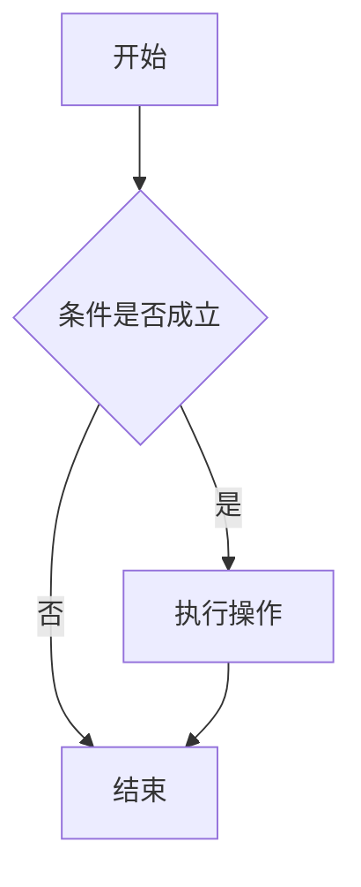
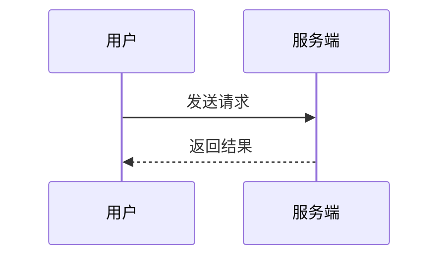
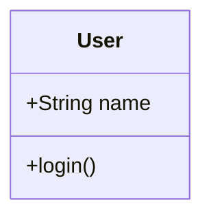

# Markdown 书写格式与语法指南

> 本文介绍常用 Markdown 书写格式、标准语法和常见扩展语法。不同平台的支持范围可能略有差异，表格、任务列表、删除线等通常属于 GitHub Flavored Markdown（GFM）扩展。

## 目录

- [1. 标题](#1-标题)
- [2. 段落与换行](#2-段落与换行)
- [3. 文字样式](#3-文字样式)
- [4. 引用](#4-引用)
- [5. 列表](#5-列表)
- [6. 代码](#6-代码)
- [7. 链接](#7-链接)
- [8. 图片](#8-图片)
- [9. 分隔线](#9-分隔线)
- [10. 表格](#10-表格)
- [11. 任务列表](#11-任务列表)
- [12. 转义字符](#12-转义字符)
- [13. 脚注](#13-脚注)
- [14. 折叠内容](#14-折叠内容)
- [15. 数学公式](#15-数学公式)
- [16. Mermaid 图表](#16-mermaid-图表)
- [17. HTML 标签](#17-html-标签)
- [18. 注释](#18-注释)
- [19. 常见错误](#19-常见错误)
- [20. 完整写作模板](#20-完整写作模板)

---

## 1. 标题

在文字前添加 `#` 表示标题。`#` 的数量代表标题级别，共六级。

```markdown
# 一级标题
## 二级标题
### 三级标题
#### 四级标题
##### 五级标题
###### 六级标题
```

推荐在 `#` 与标题文字之间保留一个空格。

一级标题和二级标题还可以使用下面的写法：

```markdown
一级标题
========

二级标题
--------
```

建议一篇文档只使用一个一级标题，并按顺序组织标题层级，不要直接从二级标题跳到四级标题。

---

## 2. 段落与换行

### 2.1 新建段落

两个段落之间保留一个空行：

```markdown
这是第一段文字。

这是第二段文字。
```

### 2.2 强制换行

常见的强制换行方式有两种：

1. 在一行末尾添加两个空格，然后按回车。
2. 使用 HTML 标签 `<br>`。

```markdown
第一行末尾有两个空格。  
第二行

第三行<br>
第四行
```

为了避免看不见的行尾空格，团队文档中通常更推荐使用空行分段，必要时再使用 `<br>`。

---

## 3. 文字样式

### 3.1 粗体

```markdown
**这是粗体文字**
__这也是粗体文字__
```

效果：**这是粗体文字**

### 3.2 斜体

```markdown
*这是斜体文字*
_这也是斜体文字_
```

效果：*这是斜体文字*

### 3.3 粗斜体

```markdown
***这是粗斜体文字***
___这也是粗斜体文字___
```

效果：***这是粗斜体文字***

### 3.4 删除线

删除线属于常见扩展语法：

```markdown
~~这是被删除的文字~~
```

效果：~~这是被删除的文字~~

### 3.5 高亮

高亮不是所有 Markdown 渲染器都支持：

```markdown
==这是高亮文字==
```

如果平台不支持，可以使用 HTML：

```html
<mark>这是高亮文字</mark>
```

### 3.6 上标与下标

上标和下标通常使用 HTML：

```html
H<sub>2</sub>O
x<sup>2</sup>
```

效果：H<sub>2</sub>O，x<sup>2</sup>

---

## 4. 引用

### 4.1 单层引用

```markdown
> 这是一段引用内容。
```

效果：

> 这是一段引用内容。

### 4.2 多段引用

```markdown
> 这是引用的第一段。
>
> 这是引用的第二段。
```

### 4.3 嵌套引用

```markdown
> 第一层引用
>
>> 第二层引用
>>
>>> 第三层引用
```

引用中也可以使用标题、列表、链接、粗体和代码等语法。

---

## 5. 列表

### 5.1 无序列表

可以使用 `-`、`*` 或 `+`，推荐在同一文档中统一使用 `-`。

```markdown
- 苹果
- 香蕉
- 橙子
```

效果：

- 苹果
- 香蕉
- 橙子

### 5.2 有序列表

```markdown
1. 第一步
2. 第二步
3. 第三步
```

Markdown 通常会自动生成正确的序号，因此也可以全部写成 `1.`：

```markdown
1. 第一步
1. 第二步
1. 第三步
```

### 5.3 嵌套列表

子列表通常缩进两个或四个空格。为了兼容更多渲染器，推荐使用四个空格。

```markdown
- 前端
    - HTML
    - CSS
    - JavaScript
- 后端
    1. Java
    2. Python
    3. Go
```

### 5.4 列表中的多段内容

列表项中的后续段落需要缩进：

```markdown
1. 第一个步骤

    这是第一个步骤的补充说明。

2. 第二个步骤
```

### 5.5 列表中的代码块

代码块需要与列表内容保持适当缩进：

````markdown
1. 安装依赖：

    ```bash
    npm install
    ```

2. 启动程序。
````

---

## 6. 代码

### 6.1 行内代码

使用一对反引号包裹行内代码：

```markdown
使用 `redis-cli` 连接 Redis。
```

效果：使用 `redis-cli` 连接 Redis。

### 6.2 代码块

使用三个反引号包裹代码块：

````markdown
```
这是一段普通代码。
```
````

### 6.3 指定代码语言

在起始反引号后写语言名称，可以启用语法高亮：

````markdown
```javascript
function add(a, b) {
  return a + b;
}
```
````

常见语言标识：

| 内容 | 标识 |
| --- | --- |
| Shell | `bash`、`shell`、`sh` |
| JavaScript | `javascript`、`js` |
| TypeScript | `typescript`、`ts` |
| Python | `python`、`py` |
| Java | `java` |
| JSON | `json` |
| YAML | `yaml`、`yml` |
| SQL | `sql` |
| HTML | `html` |
| CSS | `css` |
| Markdown | `markdown`、`md` |
| 纯文本 | `text`、`plaintext` |

### 6.4 代码中包含反引号

如果行内代码本身含有反引号，可以使用两个反引号包裹：

```markdown
``代码中包含 ` 反引号``
```

如果示例代码中包含三个反引号，可以在外层使用四个反引号。

---

## 7. 链接

### 7.1 行内链接

```markdown
[OpenAI](https://openai.com)
```

### 7.2 带提示文字的链接

```markdown
[OpenAI](https://openai.com "访问 OpenAI 官网")
```

### 7.3 直接链接

```markdown
<https://openai.com>
<name@example.com>
```

### 7.4 引用式链接

引用式链接适合在一篇文档中多次使用同一个地址：

```markdown
这是 [OpenAI][openai] 的网站。

[openai]: https://openai.com "OpenAI"
```

### 7.5 文档内跳转

```markdown
[跳转到代码章节](#6-代码)
```

锚点通常由标题自动生成，但不同平台的生成规则可能略有差异。中文标题、标点符号和重复标题尤其需要实际测试。

---

## 8. 图片

### 8.1 基本语法

```markdown

```

### 8.2 网络图片

```markdown

```

### 8.3 带提示文字的图片

```markdown

```

### 8.4 可点击图片

```markdown
[](https://example.com)
```

### 8.5 设置图片大小

标准 Markdown 不能直接设置图片尺寸，可以使用 HTML：

```html

```

替代文字应简洁描述图片传达的信息，以便图片无法加载时仍能理解内容，也有助于无障碍阅读。

---

## 9. 分隔线

在单独一行使用三个或更多的 `-`、`*` 或 `_`：

```markdown
---

***

___
```

推荐统一使用 `---`，并在分隔线前后保留空行。

---

## 10. 表格

### 10.1 基本表格

```markdown
| 姓名 | 年龄 | 城市 |
| --- | --- | --- |
| 张三 | 20 | 北京 |
| 李四 | 22 | 上海 |
```

效果：

| 姓名 | 年龄 | 城市 |
| --- | --- | --- |
| 张三 | 20 | 北京 |
| 李四 | 22 | 上海 |

### 10.2 设置对齐方式

冒号用于指定对齐方式：

```markdown
| 左对齐 | 居中对齐 | 右对齐 |
| :--- | :---: | ---: |
| 内容 | 内容 | 100 |
| 内容 | 内容 | 200 |
```

### 10.3 表格中的竖线

如果单元格内容含有 `|`，需要使用反斜杠转义：

```markdown
| 命令 | 含义 |
| --- | --- |
| `A \| B` | A 或 B |
```

### 10.4 表格使用建议

- 表格适合表达规则一致、可横向比较的数据。
- 不要把大段说明文字强行塞入表格。
- 表头应简短明确。
- 表格前后各保留一个空行，以提高兼容性。

---

## 11. 任务列表

任务列表属于 GFM 扩展语法：

```markdown
- [x] 已完成任务
- [ ] 未完成任务
- [ ] 待确认任务
```

效果：

- [x] 已完成任务
- [ ] 未完成任务
- [ ] 待确认任务

注意：方括号中的 `x` 表示完成，空格表示未完成。

---

## 12. 转义字符

当需要显示 Markdown 特殊字符本身时，在字符前添加反斜杠 `\`。

```markdown
\# 这不是标题
\*这不是斜体\*
\[这不是链接\]
```

常见可转义字符：

```text
\  `  *  _  {  }  [  ]  <  >  (  )  #  +  -  .  !  |
```

另一种可靠方式是将特殊内容放入行内代码或代码块中。

---

## 13. 脚注

脚注属于扩展语法，不是所有平台都支持：

```markdown
这句话需要补充说明。[^1]

[^1]: 这是脚注的具体内容。
```

脚注标识可以使用文字：

```markdown
Markdown 的实现可能存在差异。[^markdown]

[^markdown]: 应以目标平台的实际渲染结果为准。
```

---

## 14. 折叠内容

Markdown 本身没有统一的折叠语法，支持 HTML 的平台可以使用 `<details>`：

```html
<details>
<summary>点击查看详细内容</summary>

这里是被折叠的内容。

- 可以包含列表
- 也可以包含其他 Markdown 内容

</details>
```

在 `<summary>` 后和 `</details>` 前保留空行，通常能获得更好的兼容性。

---

## 15. 数学公式

数学公式通常使用 LaTeX 语法，但是否支持取决于渲染平台。

### 15.1 行内公式

```markdown
质能方程为 $E = mc^2$。
```

### 15.2 块级公式

```markdown
$$
f(x) = ax^2 + bx + c
$$
```

常见 LaTeX 示例：

```latex
\frac{a}{b}
\sqrt{x}
\sum_{i=1}^{n} i
\alpha + \beta
```

如果目标平台不支持数学公式，可将公式转换为图片或使用普通文本描述。

---

## 16. Mermaid 图表

Mermaid 是常见的图表扩展语法，是否支持取决于平台。

### 16.1 流程图

````markdown

````

### 16.2 时序图

````markdown

````

### 16.3 类图

````markdown

````

图表节点文字包含空格、括号或标点时，建议使用引号包裹。

---

## 17. HTML 标签

许多 Markdown 渲染器允许混合使用 HTML。

```html
<p align="center">居中的段落</p>

<kbd>Ctrl</kbd> + <kbd>C</kbd>

第一行<br>
第二行
```

常见标签：

| 标签 | 用途 |
| --- | --- |
| `<br>` | 换行 |
| `<kbd>` | 键盘按键 |
| `<sub>` | 下标 |
| `<sup>` | 上标 |
| `<mark>` | 高亮 |
| `<details>` | 折叠内容 |
| `<summary>` | 折叠标题 |
| `` | 自定义图片尺寸或属性 |

出于安全原因，一些平台会过滤 HTML 标签、样式或脚本。

---

## 18. 注释

Markdown 没有统一的可见注释语法，可以使用 HTML 注释：

```html
<!-- 这段内容不会显示在渲染结果中 -->
```

注意：注释虽然不会显示在页面上，但通常仍存在于 Markdown 源文件中，因此不要在注释里保存密码、密钥或其他敏感信息。

---

## 19. 常见错误

### 19.1 标记后没有空格

不推荐：

```markdown
#标题
-列表项
```

推荐：

```markdown
# 标题
- 列表项
```

### 19.2 段落之间没有空行

没有空行时，两行文字可能被渲染成同一个段落。

### 19.3 中英文标点混用

Markdown 语法符号通常需要使用英文半角字符，例如：

```text
# * _ ` [ ] ( ) | > -
```

### 19.4 代码围栏没有成对出现

代码块开头和结尾都需要使用相同数量的反引号。

### 19.5 嵌套列表缩进不一致

同一级子列表应使用一致的缩进宽度，否则可能出现层级错误。

### 19.6 表格前后没有空行

一些渲染器需要在表格前后保留空行才能正确识别表格。

### 19.7 图片只写文件名

需要根据 Markdown 文件所在位置填写正确的相对路径：

```markdown

```

### 19.8 依赖特定平台语法

以下语法可能不是所有平台都支持：

- 删除线
- 任务列表
- 脚注
- 数学公式
- Mermaid 图表
- 自动目录
- HTML 标签

发布前应在目标平台预览。

---

## 20. 完整写作模板

下面是一份可以直接复制使用的 Markdown 文档模板：

````markdown
# 文档标题

> 用一两句话概括文档的目的和适用范围。

## 目录

- [背景](#背景)
- [目标](#目标)
- [实施步骤](#实施步骤)
- [代码示例](#代码示例)
- [注意事项](#注意事项)
- [参考资料](#参考资料)

---

## 背景

说明问题背景、现状和编写本文的原因。

## 目标

- 目标一
- 目标二
- 目标三

## 实施步骤

1. 完成准备工作。
2. 执行核心操作。
3. 验证执行结果。

## 代码示例

```bash
echo "Hello, Markdown!"
```

## 参数说明

| 参数 | 是否必填 | 说明 |
| :--- | :---: | --- |
| `name` | 是 | 名称 |
| `port` | 否 | 服务端口 |

## 注意事项

> [!WARNING]
> 部分平台支持这种提示块语法；不支持时会显示为普通引用。

- [ ] 已检查配置
- [ ] 已备份数据
- [ ] 已验证回滚方案

## 参考资料

- [参考链接一](https://example.com)
- [参考链接二](https://example.org)

<!-- 文档内部备注，不会显示在渲染结果中 -->
````

---

## 附录：推荐的书写习惯

1. 使用一个一级标题表示文档名称。
2. 标题层级按顺序递进，避免无理由跳级。
3. 标题、列表标记和正文之间保留一个空格。
4. 段落、列表、表格和代码块之间保留适当空行。
5. 同一文档保持标记风格一致，例如统一使用 `-` 作为无序列表。
6. 代码块始终注明语言，便于阅读和语法高亮。
7. 链接文字应表达目标内容，避免只写“点击这里”。
8. 图片必须填写有意义的替代文字。
9. 表格只用于真正需要比较的数据。
10. 提交前在目标平台预览，检查目录、表格、图片和扩展语法。

